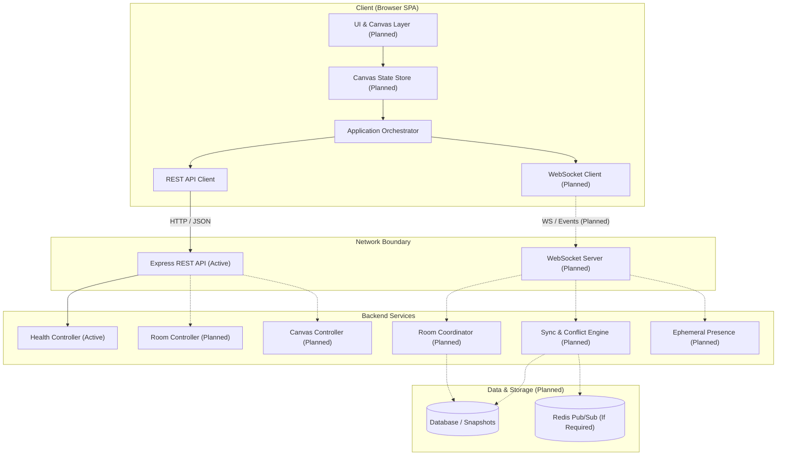

# Architecture

This document details the system architecture for the Real-Time Collaborative Canvas, outlining both the current foundational state and the planned target architecture.

## Overview

The Real-Time Collaborative Canvas is designed as a decoupled, multi-user visual workspace enabling simultaneous manipulation of graphic entities with low latency, robust state synchronization, and reliable persistence.

## Current Implementation (Day 1)

As of Day 1, the system establishes:
- **Frontend**: Vite + React SPA with TypeScript, Tailwind CSS, modular folder structure (`components/`, `pages/`, `features/canvas/`, `hooks/`, `services/`, `types/`, `lib/`, `utils/`), and a complete canvas domain model (`client/src/types/canvas.ts`).
- **Backend**: Express REST service structured with modular configuration (`server/src/config/`), controllers (`server/src/controllers/`), and routes (`server/src/routes/`), serving the operational `GET /api/health` endpoint and sharing mirrored domain definitions (`server/src/types/canvas.ts`).
- **Status**: Structural foundations, domain types, operation models, and architectural boundaries are finalized. Drawing tools, rendering loops, WebSockets, and databases are strictly not yet implemented.

## Target Architecture

The long-term architecture adopts a reactive, event-driven model connecting distributed web clients to authoritative collaborative room processes backed by persistent storage.

## Frontend Architecture

The client application is organized for modularity, testability, and clear separation of concerns:

- `src/components/`: Reusable, generic UI primitives (buttons, modals, tooltips, dialogs).
- `src/pages/`: Top-level page containers and router views.
- `src/features/canvas/`: Canvas-specific domain logic, rendering abstractions, and future tool handlers (pencil, shapes, selection).
- `src/hooks/`: Reusable React hooks for keyboard shortcuts, viewport panning/zooming, and network status.
- `src/services/`: External I/O abstractions (HTTP API client, WebSocket communication manager).
- `src/types/`: Domain models (`CanvasObject`, `CanvasOperation`, `CanvasState`), shape definitions, and API contracts.
- `src/lib/`: External library wrappers and math/geometry utilities.
- `src/utils/`: General helper functions (ID generators, color helpers, debounce/throttle).

## Backend Architecture

The backend follows an idiomatic layered Express architecture:

- `src/config/`: Environment variable validation and runtime configuration loading.
- `src/controllers/`: HTTP request validation, input parsing, and response formatting.
- `src/routes/`: Route declarations and path routing.
- `src/services/`: Core business logic, room coordination, and state reconciliation (planned).
- `src/middleware/`: Authentication, rate limiting, and request logging middlewares (planned).
- `src/models/`: Data persistence schemas and queries (planned).
- `src/types/`: Shared domain models and TypeScript interfaces.
- `src/utils/`: Server utilities, error handlers, and logger abstractions.

## Domain Model

Canvas content is modeled as discrete structured objects rather than a raster bitmap.
- **Base Properties**: Every object contains an immutable `id`, discriminator `type`, geometric transforms (`x`, `y`, `rotation`, `scaleX`, `scaleY`), rendering attributes (`opacity`, `zIndex`), and audit metadata (`createdAt`, `updatedAt`, `createdBy`).
- **Discriminated Union**: Concrete types (`rectangle`, `ellipse`, `line`, `stroke`, `text`) define strict shape-specific attributes.
- **Canvas State**: `CanvasState` holds an object map (`Record<string, CanvasObject>`) for $O(1)$ mutation access, an `objectOrder` array for deterministic layering, and monotonic `version` tracking.
- **Operation Model**: Mutations are encapsulated as discrete `CanvasOperation` records (`CREATE_OBJECT`, `UPDATE_OBJECT`, `DELETE_OBJECT`, `MOVE_OBJECT`, `REORDER_OBJECT`) with unique `operationId`s for idempotency and `clientId` attributes for attribution.

## Communication

### REST API
- **Current**: Health check (`GET /api/health`).
- **Planned**: Resource creation, room token generation, canvas metadata retrieval, snapshot persistence, and export services.

### WebSocket (Planned)
- Full-duplex transport for low-latency operational sync, presence awareness (cursors, active selections), and room event broadcasting.

## Persistence (Planned)

Canvas state will be persisted using a snapshot-and-log strategy:
- Periodic or on-demand serialized snapshots of `CanvasState`.
- Incremental operation logs for temporal replay and version history.

## Synchronization (Planned)

Concurrent modifications across clients will be reconciled via a dedicated synchronization engine. The evaluation between server-authoritative reconciliation, Operational Transformation (OT), and Conflict-free Replicated Data Types (CRDT) is underway (see [docs/synchronization.md](synchronization.md)).

## Scalability Considerations

- **Stateless API tier**: REST endpoints operate statelessly, allowing horizontal scaling behind standard load balancers.
- **Room affinity**: Real-time WebSocket connections will utilize sticky sessions or a Redis-backed pub/sub transport when scaling across multiple server processes.
- **Client performance**: Canvas objects will be indexed spatially to allow viewport culling and minimize redraw overhead.
