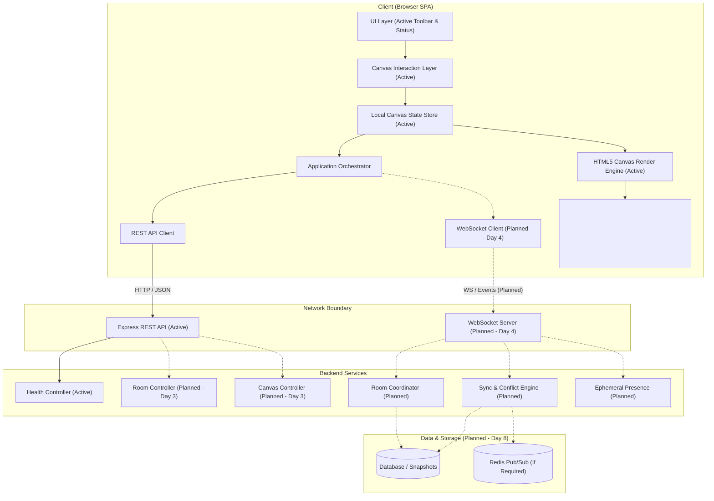

# Architecture

This document details the system architecture for the Real-Time Collaborative Canvas, outlining both the current foundational state and the planned target architecture.

## Overview

The Real-Time Collaborative Canvas is designed as a decoupled, multi-user visual workspace enabling simultaneous manipulation of graphic entities with low latency, robust state synchronization, and reliable persistence.

## Current Implementation (Day 3)

As of Day 3, the system establishes:
- **User Authentication**: Secure user registration, credential verification, bcrypt password hashing (10 salt rounds), JWT Bearer token generation/verification, and current user retrieval (`/api/auth/me`).
- **Room Management & Boundaries**: Mongoose `Room` and `Canvas` models with relational integrity (`User -> Room -> Canvas`), room creation, joining, leaving, and listing. Room owners are protected against accidental orphaning.
- **Client Application State**: React `AuthProvider` with token storage, clean `LoginForm`, `RegisterForm`, and `Dashboard` UI with room creation and join-by-ID modals.
- **Canvas Inside Room Context**: Canvases load within the authenticated room context, displaying room title, ID, and dashboard navigation.
- **Canvas Interaction Hardening**:
  - Pointer capture via `setPointerCapture` and safe release on `pointerup` and `pointercancel`.
  - Thorough cleanup of all interaction refs to prevent stuck drawing or panning.
  - Rotation-aware geometric hit testing for transformed rectangles.
  - Robust 4-corner resizing enforcing non-negative, minimum dimensions (10px) with reverse drag stability.
  - Pure reducer tests covering all state mutations, versioning, and timestamp updates.
  - Defensive rendering guards preventing crashes on malformed shapes.
  - Keyboard shortcut safety preventing tool changes when typing in inputs or content-editable elements.
- **Testing**: Vitest suites for authentication, room authorization, security, geometry, coordinates, and reducer state mutations.

> [!IMPORTANT]
> Day 3 provides authentication and room boundaries. Real-time collaboration, WebSocket networking, and operational synchronization are not implemented yet.

## Target Architecture

The long-term architecture adopts a reactive, event-driven model connecting distributed web clients to authoritative collaborative room processes backed by persistent storage.



## Canvas Engine Architecture (Day 2)

### 1. Data Flow Pipeline

```text
Pointer Input (Mouse / Stylus)
      ↓
Interaction Layer (useCanvasInteraction)
      ↓
World Coordinates (screenToWorld)
      ↓
Local State Mutation (canvasStateReducer)
      ↓
Render Pipeline (renderCanvas)
      ↓
HTML5 2D Canvas Context (<canvas>)
```

### 2. Coordinate System

The engine strictly distinguishes **Screen Coordinates** from **World Coordinates**:

- **Screen Coordinates** ($s_x, s_y$): Physical CSS pixels relative to the top-left of the `<canvas>` viewport DOM element.
- **World Coordinates** ($w_x, w_y$): Infinite Cartesian space where objects are positioned and dimensioned.
- **Transformation Formula**:
  $$s_x = w_x \cdot \text{zoom} + \text{viewport.x}$$
  $$s_y = w_y \cdot \text{zoom} + \text{viewport.y}$$
- **Inverse Transformation (Un-projection)**:
  $$w_x = \frac{s_x - \text{viewport.x}}{\text{zoom}}$$
  $$w_y = \frac{s_y - \text{viewport.y}}{\text{zoom}}$$

### 3. Viewport & Camera Model

The `CanvasViewport` maintains:
- `x`, `y`: Pan offset translation in screen pixels.
- `zoom`: Scale multiplier (clamped between $0.1$ and $5.0$).
- **Zoom Invariance**: When zooming with the mouse wheel, the point under the cursor in world coordinates remains invariant, providing intuitive CAD/Figma-style navigation.

### 4. Rendering Pipeline

Rendering is decoupled from React component lifecycles to enable fluid, responsive performance:
1. **Device Pixel Ratio Scaling**: Canvas backing store is scaled by `window.devicePixelRatio`, preventing blurriness on Retina screens while CSS width/height remains responsive.
2. **Transform Reset**: Context matrix is cleared before each render frame.
3. **Infinite Dot Grid**: Screen-space dot pattern generated dynamically based on modulo arithmetic of viewport pan and zoom.
4. **World Transformation Matrix**: `ctx.translate(viewport.x, viewport.y)` and `ctx.scale(viewport.zoom, viewport.zoom)`.
5. **Layer Ordering**: Objects iterated strictly according to `canvasState.objectOrder` to preserve deterministic z-layering.
6. **Selection Overlay**: Active selection bounding box and 4 corner resize handles rendered in a top pass.
7. **Preview Layer**: In-flight creation previews (e.g. while dragging to draw shapes or freehand lines) rendered before commit.

### 5. Hit-Testing & Selection

Hit testing determines object intersection in world coordinates:
- **Rectangles**: Rotation-aware geometric hit testing using inverse rotation transforms into local coordinate space.
- **Ellipses**: Normalized quadratic distance check ($(\Delta x / r_x)^2 + (\Delta y / r_y)^2 \le 1$).
- **Lines & Strokes**: Minimum Euclidean distance to line segments with configurable stroke tolerance.
- **Reverse Z-Order Scanning**: Hit tests scan `objectOrder` in reverse order so the visually top-most object is selected first.

## Frontend Architecture

The client application is organized for modularity, testability, and clear separation of concerns:

- `src/components/`: Reusable, generic UI primitives.
- `src/pages/`: Top-level page containers and router views.
- `src/features/canvas/`:
  - `components/`: Master `Canvas.tsx`, `CanvasToolbar.tsx`, `CanvasStatusBar.tsx`.
  - `hooks/`: `useCanvasInteraction.ts`.
  - `rendering/`: `renderCanvas.ts`, `renderObject.ts`, `renderSelection.ts`.
  - `state/`: `canvasState.ts` reducer.
  - `types/`: `interaction.ts`.
  - `utils/`: `coordinates.ts`, `geometry.ts`, `hitTesting.ts`.
- `src/types/`: Domain models (`CanvasObject`, `CanvasOperation`, `CanvasState`), shape definitions, and API contracts.
- `src/utils/`: General utility helpers.

## Backend Architecture

The backend follows an idiomatic layered Express architecture:

- `src/config/`: Environment variable validation and runtime configuration loading.
- `src/controllers/`: HTTP request validation, input parsing, and response formatting.
- `src/routes/`: Route declarations and path routing.
- `src/services/`: Core business logic, room coordination, and state reconciliation (planned).
- `src/middleware/`: Authentication, rate limiting, and request logging middlewares (planned).
- `src/models/`: Data persistence schemas and queries (planned).
- `src/types/`: Shared domain models and TypeScript interfaces.
- `src/utils/`: Server utilities, error handlers, and logger abstractions.

## Domain Model

Canvas content is modeled as discrete structured objects rather than a raster bitmap.
- **Base Properties**: Every object contains an immutable `id`, discriminator `type`, geometric transforms (`x`, `y`, `rotation`, `scaleX`, `scaleY`), rendering attributes (`opacity`, `zIndex`), and audit metadata (`createdAt`, `updatedAt`, `createdBy`).
- **Discriminated Union**: Concrete types (`rectangle`, `ellipse`, `line`, `stroke`, `text`) define strict shape-specific attributes.
- **Canvas State**: `CanvasState` holds an object map (`Record<string, CanvasObject>`) for $O(1)$ mutation access, an `objectOrder` array for deterministic layering, and monotonic `version` tracking.
- **Operation Model**: Mutations are encapsulated as discrete `CanvasOperation` records (`CREATE_OBJECT`, `UPDATE_OBJECT`, `DELETE_OBJECT`, `MOVE_OBJECT`, `REORDER_OBJECT`).

## Communication

### REST API
- **Current**: Health check (`GET /api/health`).
- **Planned (Day 3)**: Room creation, canvas metadata retrieval, snapshot persistence.

### WebSocket (Planned - Day 4)
- Full-duplex transport for low-latency operational sync, presence awareness (cursors, active selections), and room event broadcasting.

## Persistence (Planned - Day 8)

Canvas state will be persisted using a snapshot-and-log strategy:
- Periodic or on-demand serialized snapshots of `CanvasState`.
- Incremental operation logs for temporal replay and version history.

## Synchronization (Planned - Day 6)

Concurrent modifications across clients will be reconciled via a dedicated synchronization engine. The evaluation between server-authoritative reconciliation, Operational Transformation (OT), and Conflict-free Replicated Data Types (CRDT) is underway.

## Scalability Considerations

- **Stateless API tier**: REST endpoints operate statelessly, allowing horizontal scaling behind standard load balancers.
- **Room affinity**: Real-time WebSocket connections will utilize sticky sessions or a Redis-backed pub/sub transport when scaling across multiple server processes.
- **Client performance**: Canvas objects will be indexed spatially to allow viewport culling and minimize redraw overhead.
