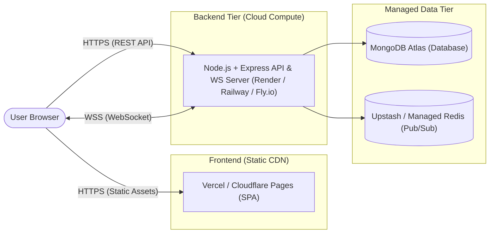

# Deployment Strategy

> [!WARNING]
> The application is **NOT deployed as of Day 1**. The infrastructure topology described below represents the planned production target for Day 9.

---

## 1. Planned Infrastructure Topology

---

## 2. Component Hosting

1. **Frontend Client**:
   - Platform: Vercel or Cloudflare Pages.
   - Type: Single Page Application (SPA) compiled via Vite into static HTML, CSS, and JS bundles.
   - Advantages: Global edge CDN distribution, automatic HTTPS, sub-second asset delivery.

2. **Backend API & WebSocket Server**:
   - Platform: Cloud compute runtime supporting long-lived persistent WebSocket connections (e.g., Render, Railway, or Fly.io).
   - Process: Node.js production process running compiled `dist/index.js`.
   - Scalability: Configured with horizontal replica nodes and sticky routing or pub/sub bridging.

3. **Data Layer**:
   - Database: MongoDB Atlas managed cluster.
   - Cache / Broker: Upstash Redis (if distributed room synchronization across multi-instance backends is required).

---

## 3. Environment Variables Strategy

Production environments will provide isolated configurations:
- `PORT`: Server listen port assigned by hosting provider.
- `NODE_ENV`: Set to `production`.
- `CORS_ORIGIN`: Permitted frontend origin URL.
- `DATABASE_URI`: Connection string for MongoDB Atlas (planned).

---

## 4. CI/CD Automation (Planned)

A continuous integration pipeline will run lint checks, type validations, and test suites prior to triggering zero-downtime rolling deployments.
